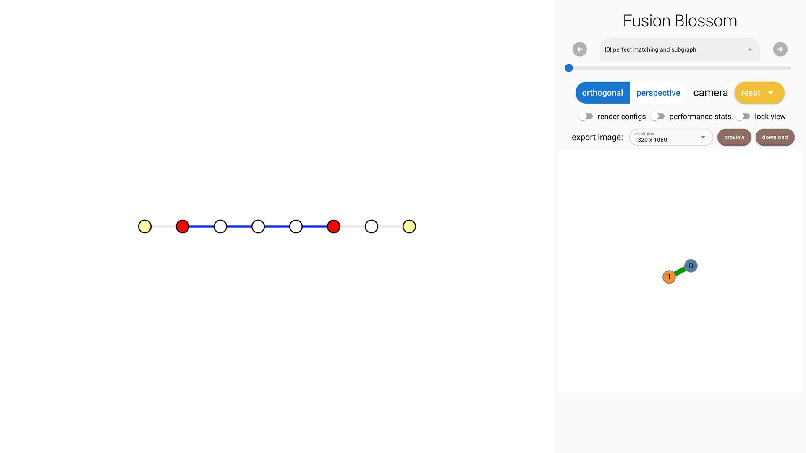

# Construct Decoding Graph

In this chapter you'll learn how to construct your own decoding graph.
Please make sure you understand everything about decoding graph in the [Problem Definition Chapter](../problem_definition.md).

You can [download the complete code here](./construct-decoding-graph.py).

## Code Definition

We construct a customized repetition code with non-i.i.d. noise model.
That is, each qubit can have different probability of errors.
First we define a class representing this customized QEC code.
It must have two functions: `get_positions` and `get_initializer`.
We leave the detailed implementation of them to later part.
For the code itself, it takes a code distance \\( d \\) and a list of error rates \\( \\{ p_e \\} \\) specifying the error rate on each of the \\( d \\) data qubits.

```python
import fusion_blossom as fb
import math

class CustomRepetitionCode:
    """A customize repetition code with non-i.i.d. noise model"""
    def __init__(self, d, p_vec):
        assert len(p_vec) == d
        self.d = d
        self.p_vec = p_vec
    def get_initializer(self):
        # missing implementation
    def get_positions(self):
        # missing implementation
```

## Construct Initializer

There are \\( d \\) qubits in a chain, and the repetition code stabilizers exist in between every neighbor pair of qubits.
Thus, there are \\( d-1 \\) stabilizer qubits.
For simplicity we assume there are no measurement errors so we just need to decode a single round of measurement, which has \\( d-1 \\) real vertices.
Since the qubit on the left and right will generate a single non-trivial measurement event, a virtual vertex is added on the left and right respectively.
Thus, there are `vertex_num = (d - 1) + 2` vertices in the decoding graph, in which the first and last are virtual vertices.

For the edges, we first calculate the weight using \\( w_e = \ln \frac{1 - p_e}{p_e} \\).
The fusion blossom algorithm takes even integer weight as input (which is also the default and recommended behavior in Blossom V library).
In order to minimize numerical error in the computation, we scale all the weight up to a maximum of `2 * max_half_weight`.

```python
class CustomRepetitionCode:
    def get_initializer(self, max_half_weight=500):
        vertex_num = (self.d - 1) + 2
        virtual_vertices = [0, vertex_num - 1]
        real_weights = [math.log((1 - pe) / pe, math.e) for pe in self.p_vec]
        scale = max_half_weight / max(real_weights)
        half_weights = [round(we * scale) for we in real_weights]
        weighted_edges = [(i, i+1, 2 * half_weights[i]) for i in range(vertex_num-1)]
        return fb.SolverInitializer(vertex_num, weighted_edges, virtual_vertices)
```

An example output for `d = 7, p_vec = [1e-3, 0.01, 0.01, 0.01, 0.01, 1e-3, 1e-3]` is

```
SolverInitializer {
    vertex_num: 8,
    weighted_edges: [(0, 1, 1000), (1, 2, 666), (2, 3, 666), (3, 4, 666)
        , (4, 5, 666), (5, 6, 1000), (6, 7, 1000)],
    virtual_vertices: [0, 7]
}
```

## Construct Positions [Optional]

Positions are required only when you want to use the visualization tool.
We just put all the vertices in a row in a equal space, although the actual weight of edges might be different.

```python
class CustomRepetitionCode:
    def get_positions(self):
        return [fb.VisualizePosition(0, i, 0) for i in range(self.d + 1)]
```

## Code Initialization

```python
p_vec = [1e-3, 0.01, 0.01, 0.01, 0.01, 1e-3, 1e-3]
code = CustomRepetitionCode(d=len(p_vec), p_vec=p_vec)
```

## Construct Syndrome

We use a syndrome pattern below to demonstrate the effect of weights.

```python
syndrome = fb.SyndromePattern(syndrome_vertices=[1,5])
```

As shown in the following image, there are 4 edges selected in the Minimum-Weight Parity Subgraph (MWPS).
This is because the weight sum of these 4 edges is 2664 but the sum of the other 3 edges is 3000.
This can only be explained by the fact that the probability is roughly \\( 0.01^4 = 10^{-8} \\) for the MWPS, but the other solutions has a probability of roughly \\( 0.001^3 = 10^{-9} \\) which is less likely.



## Visualize Result

The same process as in [Example QEC Codes Chapter](./example-qec-codes.md).

```python
visualizer = None
if True:  # change to False to disable visualizer for faster decoding
    visualize_filename = fb.static_visualize_data_filename()
    positions = code.get_positions()
    visualizer = fb.Visualizer(filepath=visualize_filename, positions=positions)

initializer = code.get_initializer()
solver = fb.SolverSerial(initializer)

solver.solve(syndrome)

subgraph = solver.subgraph(visualizer)
print(f"Minimum Weight Parity Subgraph (MWPS): {subgraph}")  # Vec<EdgeIndex>

if visualizer is not None:
    fb.print_visualize_link(filename=visualize_filename)
    fb.helper.open_visualizer(visualize_filename, open_browser=True)
```
