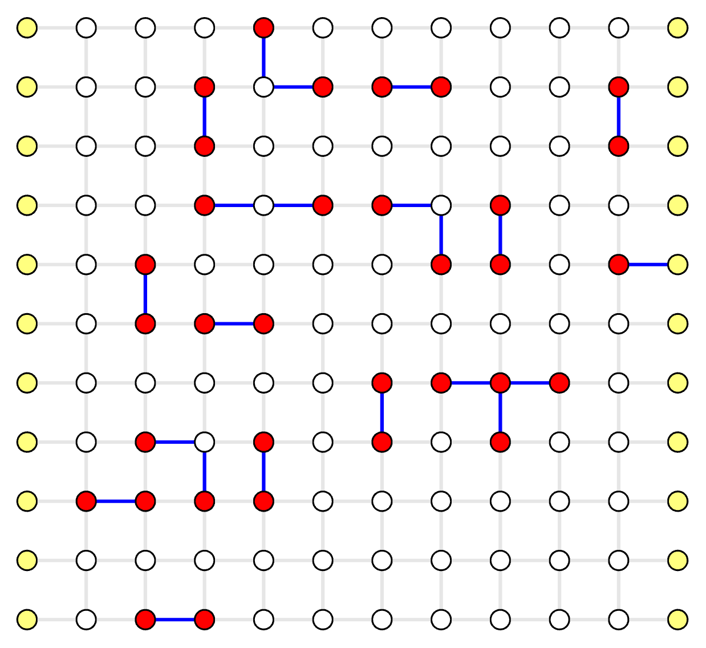

# Decode Erasure Error

In this chapter you'll learn how to decode erasure errors, i.e. a known-position error.

You can [download the complete code here](./decode-erasure-error.py).

## Concepts

An erasure error is a known-position error where a qubit is replaced with a fresh qubit and can be modeled as going through error channel:

\\[ \rho' = \frac{1}{4}(\rho + \hat{X}\rho\hat{X} + \hat{Y}\rho\hat{Y} + \hat{Z}\rho\hat{Z}) \\]

Note that this kind of "loss" errors inherently exist, but knowing its position, aka erasure conversion, can help the decoder reach much higher accuracy than not using this position information.
In the decoding graph, some of the edges must update their weights in order to utilize this position information.
One way to do so is to set the weights of the corresponding edges to 0, because given a total loss \\( p_e = \frac{1}{2} \\), the weight is calculated by \\( \ln\frac{1-p_e}{p_e} = 0 \\).
Fusion blossom library has native support for decoding erasure errors, by dynamically set some of the weights to 0.

## Code Initialization

We use the erasure simulation in the example QEC codes.
By setting the erasure probability, each edge is subject to erasure errors.

```python
code = fb.CodeCapacityPlanarCode(d=11, p=0.05, max_half_weight=500)
code.set_erasure_probability(0.1)
```

## Simulate Random Errors

```python
syndrome = code.generate_random_errors(seed=1000)
print(syndrome)
```

An example output is

```
SyndromePattern {
    syndrome_vertices: [3, 14, 16, 17, 18, 21, 26, 33, 39, 40, 41, 54, 57, 62, 63
        , 79, 85, 87, 91, 96, 97, 98, 99, 121, 122],
    erasures: [10, 18, 41, 80, 92, 115, 159, 160, 161, 168, 180, 205, 206, 211]
}
```

The erasures are edge indices, whose weights will be set to 0 in the solver (red edges below).

<div style="display: flex; justify-content: center;">
    
</div>


## Visualize Result

The same process as in [Example QEC Codes Chapter](./example-qec-codes.md).

<div style="display: flex; justify-content: center;">
    
</div>
