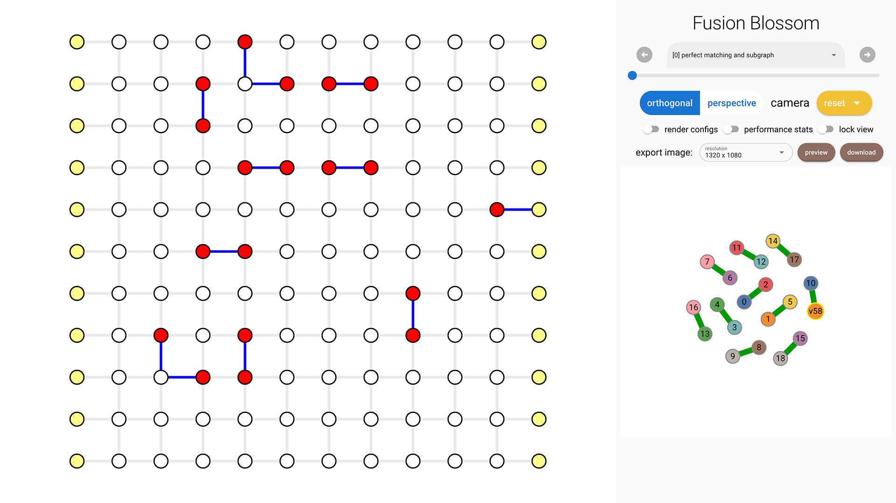

# Example QEC Codes

You can [download the full code here](./example-qec-codes.py).

## Code Initialization

We provide several example QEC codes to demonstrate our solver.
The code is defined by dimensions (usually code distance \\( d \\) and rounds of noisy measurement).
The noise model is a simple i.i.d. noise model, given physical error rate \\( p \\).

```python
import fusion_blossom as fb

code = fb.CodeCapacityPlanarCode(d=11, p=0.05, max_half_weight=500)
```

Current available QEC codes and noise models are:

- `CodeCapacityRepetitionCode(d, p)`
- `CodeCapacityPlanarCode(d, p)`
- `PhenomenologicalPlanarCode(d, noisy_measurements, p)`
- `CircuitLevelPlanarCode(d, noisy_measurements, p)`

## Simulate Random Errors

The example QEC code object can simulate random errors, outputs a syndrome pattern.
You can provide a seed for the internal pseudo random number generator, otherwise it will use system-level random number for the seed.
A syndrome pattern includes syndrome vertices (non-trivial stabilizer measurements) and also erasures (known-position errors, given by edge indices).

```python
syndrome = code.generate_random_errors(seed=1000)
print(syndrome)
```

An example output is: `SyndromePattern { syndrome_vertices: [3, 14, 16, 17, 18, 26, 39, 40, 41, 42, 57, 62, 63, 79, 85, 87, 91, 98, 99], erasures: [] }`

## Initialize Visualizer [Optional]

```python
visualizer = None
if True:  # change to False to disable visualizer for faster decoding
    visualize_filename = fb.static_visualize_data_filename()
    positions = code.get_positions()
    visualizer = fb.Visualizer(filepath=visualize_filename, positions=positions)
```

## Initialize Solver

We use `SolverSerial` here as an example. Other solvers like `SolverDualParallel` and `SolverParallel` requires more input, please check Rust documentation for more information.
For the example QEC codes, we provide the initializer for the solver, but essentially it's a very simple format.
Please check [Construct Graph Chapter](./construct-graph.md) for more details of constructing your own decoding graph initializer.

```python
initializer = code.get_initializer()
solver = fb.SolverSerial(initializer)
```

## Run Solver

The solver takes the syndrome as input and runs to a stable state. It also takes an optional parameter `visualizer`, to inspect the process of the problem being solver.

```python
solver.solve(syndrome)
```

## Print Minimum-Weight Parity Subgraph (MWPS)

For definition of MWPM, please see [Problem Definition Chapter](../problem_definition.md).
The function `subgraph()` takes an optional visualizer object for visualization of the subgraph.

```python
subgraph = solver.subgraph(visualizer)
print(f"Minimum Weight Parity Subgraph (MWPS): {subgraph}")
```

An example output is: `Minimum Weight Parity Subgraph (MWPS): [14, 24, 26, 34, 66, 68, 93, 107, 144, 159, 161, 169]`. Each number is an edge index, starting from 0 in the `initializer.weighted_edges` list. The visualization tool below can help identify those edges. You can click an edge to see its index.



## Print Minimum-Weight Perfect Matching (MWPM)

For a traditional decoder implementation, it may want to take perfect matching as input.
We also provide a method to get the minimum-weight perfect matching, grouped into two parts:

- `peer_matchings: Vec<(SyndromeIndex, SyndromeIndex)>`: list of matched syndrome pairs
- `virtual_matchings: Vec<SyndromeIndex, VertexIndex>`: list of syndrome matched to virtual vertices.

Note that type `SyndromeIndex` means the index applies to the syndrome list (usually used in a traditional decoder implementation).
In order to get the matched syndrome vertex indices, simply use the `syndrome.syndrome_vertices` list.

```python
perfect_matching = solver.perfect_matching()
syndrome_vertices = syndrome.syndrome_vertices
print(f"Minimum Weight Perfect Matching (MWPM):")
print(f"    - peer_matchings: {perfect_matching.peer_matchings}")
peer_matching_vertices = [(syndrome_vertices[a], syndrome_vertices[b])
                            for a, b in perfect_matching.peer_matchings]
print(f"          = vertices: {peer_matching_vertices}")
virtual_matching_vertices = [(syndrome_vertices[a], b)
                            for a, b in perfect_matching.virtual_matchings]
print(f"    - virtual_matchings: {perfect_matching.virtual_matchings}")
print(f"             = vertices: {virtual_matching_vertices}")
```

## Clear Solver

The solver is optimized to be repeatedly used, because the object construction is very expensive compared given usually a few syndrome vertices.
The clear operation is a constant time operation.

```python
solver.clear()
```

## Visualization [Optional]

If you enabled the visualizer, then you can view it in your browser.
The Python package embeds the visualizer, so that you can view the visualizer output locally (by default to `fb.static_visualize_data_filename()` which is `visualizer.json`).
For more details about the visualizer and its usage, please refer to [Visualizer Usage Chapter](../visualizer_usage.md).

```python
if visualizer is not None:
    fb.print_visualize_link(filename=visualize_filename)
    fb.helper.open_visualizer(visualize_filename, open_browser=True)
```
