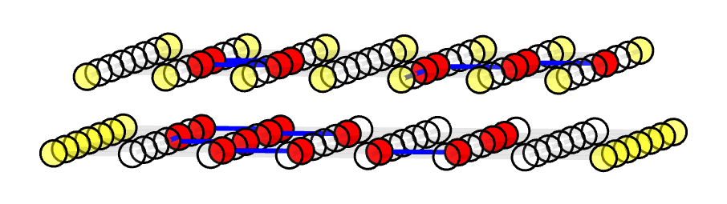
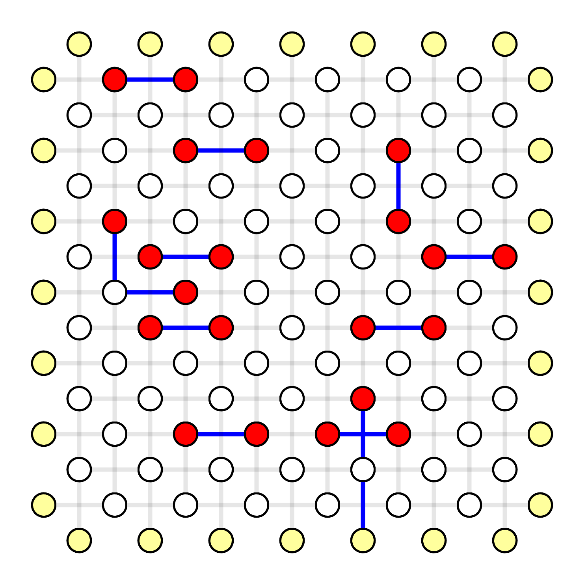
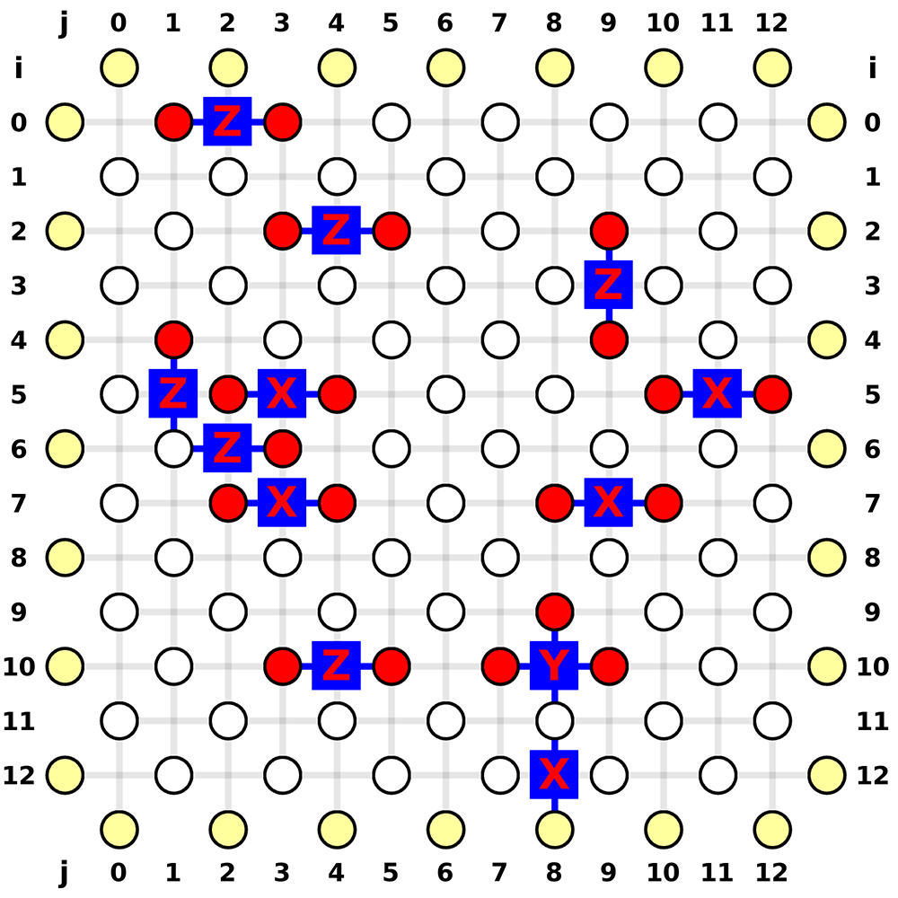

# Use Results

In this chapter you'll learn how to use the MWPS results to construct the most likely error pattern.

You can [download the complete code here](./use-results.py).

## Code Initialization

In a surface code with perfect measurement, we usually need to decode X stabilizers and Z stabilizers separately.
The X stabilizers detect Pauli Z errors on data qubit, and Z stabilizers detect Pauli X errors on data qubit.
For those more complex circuit-level noise model, it's similar but just some edges do not correspond to data qubit errors.

We first construct an example planar code. Note that this is only for either X stabilizer or Z stabilizer.
It's perfectly fine to decode them separately, but in this case, I'll put both X and Z decoding graphs into a single decoding graph for better visual effect.
They're still disconnected, as shown in the 3D plot here:

<div style="display: flex; justify-content: center;">
    
</div>

```python
code = fb.CodeCapacityPlanarCode(d=7, p=0.1, max_half_weight=500)
```

## Initialize Visualizer [Optional]

In order to plot them in a correct geometry, we swap the vertical `i` and horizontal `j` parameters for the the Z decoding graph.
We also place the Z decoding graph on top of the X decoding graph by setting `t = 1`, which do not affect the top view but can better distinguish X and Z decoding graphs if viewing in another direction (like the figure above).

```python
visualizer = None
positions_x = code.get_positions()
positions_x = fb.center_positions(positions_x)
positions_z = [fb.VisualizePosition(pos.j, pos.i, 1) for pos in positions_x]
positions = positions_x + positions_z
if True:  # change to False to disable visualizer for faster decoding
    visualize_filename = fb.static_visualize_data_filename()
    visualizer = fb.Visualizer(filepath=visualize_filename, positions=positions)
```

## Initialize Solver

We join the X and Z decoding graph.
Note that this is not recommended for real applications but here we want to put X and Z decoding graph into a single graph for better visual.

```python
initializer_x = code.get_initializer()
bias = initializer_x.vertex_num
weighted_edges_x = initializer_x.weighted_edges
virtual_vertices_x = initializer_x.virtual_vertices
weighted_edges_z = [(i + bias, j + bias, w) for (i, j, w) in weighted_edges_x]
virtual_vertices_z = [i + bias for i in virtual_vertices_x]
vertex_num = initializer_x.vertex_num * 2
weighted_edges = weighted_edges_x + weighted_edges_z
virtual_vertices = virtual_vertices_x + virtual_vertices_z
initializer = fb.SolverInitializer(vertex_num, weighted_edges, virtual_vertices)
solver = fb.SolverSerial(initializer)
```

## Simulate Random Errors

We assume Pauli X and Pauli Z are independent error sources here for demonstration.
Note that this is not depolarizing noise model.
User should generate syndrome according to noise model instead of the graph itself.

```python
syndrome_x = code.generate_random_errors(seed=1000)
syndrome_z = code.generate_random_errors(seed=2000)
syndrome_vertices = syndrome_x.syndrome_vertices
syndrome_vertices += [i + bias for i in syndrome_z.syndrome_vertices]
syndrome = fb.SyndromePattern(syndrome_vertices)
```

## Visualize Result

The same process as in [Example QEC Codes Chapter](./example-qec-codes.md).

```python
solver.solve(syndrome)

subgraph = solver.subgraph(visualizer)
print(f"Minimum Weight Parity Subgraph (MWPS): {subgraph}")  # Vec<EdgeIndex>

if visualizer is not None:
    fb.print_visualize_link(filename=visualize_filename)
    fb.helper.open_visualizer(visualize_filename, open_browser=True)
```

<div style="display: flex; justify-content: center;">
    
</div>

## Generate Most Likely Error Pattern

Given the Minimum Weight Parity Subgraph (MWPS) is `[0, 14, 24, 33, 39, 66, 68, 107, 108, 141, 142, 147, 159]`, now we need to construct the most likely error pattern as the result of MWPM decoder.
Here we use the position of qubit to identify qubits.
In real applications, one should record what are the corresponding physical errors for each edge when generating the decoding graph, so that it can query the error source for each edge.

```python
error_pattern = dict()
for edge_index in subgraph:
    v1, v2, _ = weighted_edges[edge_index]
    qubit_i = round(positions[v1].i + positions[v2].i) + 6
    qubit_j = round(positions[v1].j + positions[v2].j) + 6
    error_type = "Z" if edge_index < len(weighted_edges_x) else "X"
    if (qubit_i, qubit_j) in error_pattern:
        error_pattern[(qubit_i, qubit_j)] = "Y"
    else:
        error_pattern[(qubit_i, qubit_j)] = error_type
print("Most Likely Error Pattern:", error_pattern)
```

An example output is

```ini
Most Likely Error Pattern: {
    (0, 2): 'Z',
    (2, 4): 'Z',
    (3, 9): 'Z',
    (5, 1): 'Z',
    (6, 2): 'Z',
    (10, 4): 'Z',
    (10, 8): 'Y',  # here is a Pauli Y error
    (5, 3): 'X',
    (7, 3): 'X',
    (12, 8): 'X',
    (7, 9): 'X',
    (5, 11): 'X'
}
```

The position indices and the most likely error pattern is marked below:

<div style="display: flex; justify-content: center;">
    
</div>
