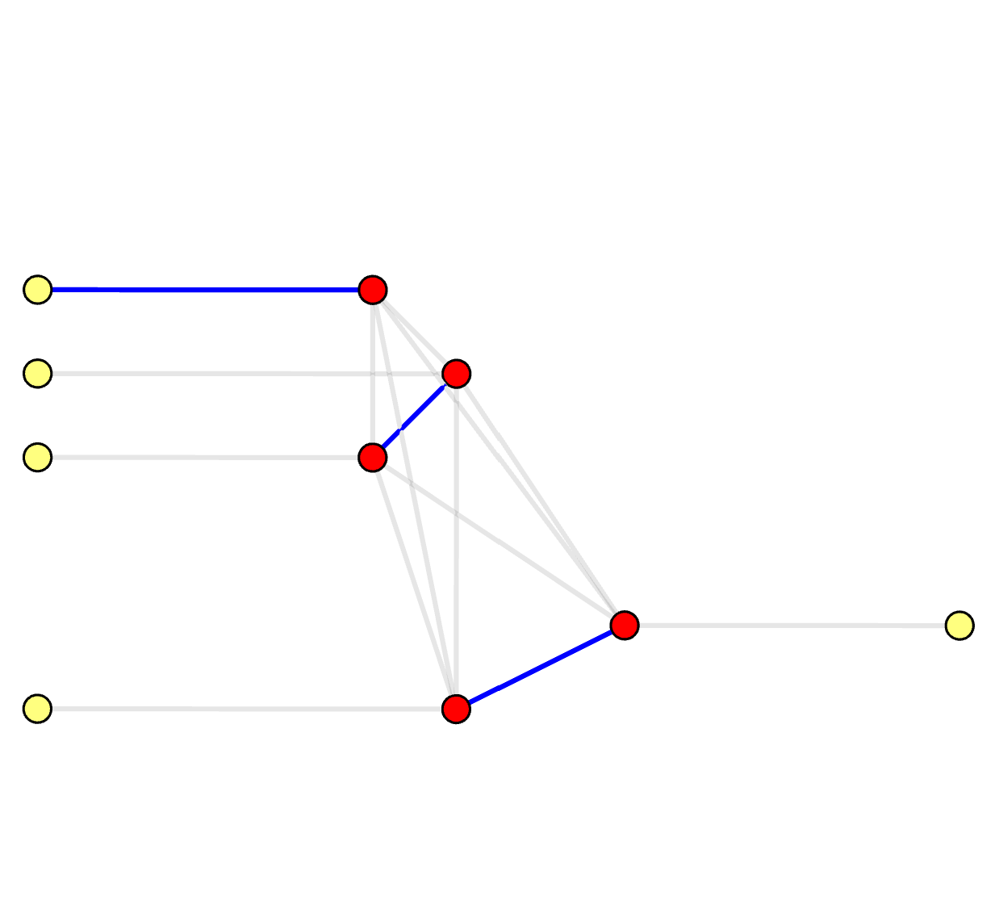

# Problem Definition

We'll formally define the problem we're solving in this chapter.

We shall note that although fusion-blossom is a Minimum-Weight Perfect Matching (MWPM) solver, it only implicitly works on the complete graph where the MWPM problem is defined.
In fact, our speed advantage originates from the sparse graph (*decoding graph*) we use that can implicitly yet accurately solve the problem on the complete graph (*syndrome graph*).

## Decoding Graph <strong style="color:lightgrey;">vs.</strong> Syndrome Graph

The decoding graph \\( (V_D, E_D) \\) is naturally defined by the QEC code and the noise model.
Every real vertex \\( v \in V_D \\) is a stabilizer measurement result.
Every edge \\( e = \langle u, v \rangle \in E_D \\) corresponds to independent physical error(s) that can cause a pair of non-trivial measurement results on vertices \\( u, v \\).
Each edge has a non-negative weight \\( w_e \\), calculated by \\( \ln \frac{1-p_e}{p_e} \\) for the aggregated physical error rate \\( p_e \le \frac{1}{2} \\) (see [explanation here](#how-mwpm-decoder-works)).
For open-boundary QEC codes, there are some errors that only generate a single non-trivial measurement. We add some *virtual vertices* to the graph which is not a real stabilizer measurement but can be connected by such an edge.

The syndrome Graph \\( (V_S, E_S) \\) is generated from the decoding graph.
In the syndrome graph, \\( V_S \subseteq V_D \\), where real vertices with trivial measurement results are discarded, and only syndrome vertices and some virtual vertices are preserved.
Syndrome graph first constructs a complete graph for the syndrome vertices, meaning there are edges between any pair of syndrome vertices.
The weight of each edge in the syndrome graph \\( e = \langle u_S, v_S \rangle \in E_S \\) is calculated by finding the minimum-weight path between \\( u_S, v_S \in V_D \\) in the decoding graph.
Apart from this complete graph, each vertex also connects to a virtual vertex if there exists a path towards any virtual vertex.
For simplicity each real vertex only connects to one nearest virtual vertex.


- white circle: real vertex \\( v \in V_D, v \notin V_S \\), a trivial stabilizer measurement
- red circle: syndrome vertex \\( v \in V_D, v \in V_S \\), a non-trivial stabilizer measurement
- yellow circle: virtual vertex  \\( v \in V_D \\), non-existing stabilizer that is only used to support physical errors on the boundary of an open-boundary QEC code
- grey line: decoding graph edge \\( e \in E_D \\)
- pink line: syndrome graph edge \\( e \in E_S \\)

<div style="display: flex; justify-content: center;">
    <div style="width: 49%; text-align: center;">
        
        <p>Decoding Graph</p>
    </div>
    <div style="width: 49%; text-align: center;">
        
        <p>Syndrome Graph</p>
    </div>
</div>

On the syndrome graph, it's clear that it solves a Minimum-Weight Perfect Matching (MWPM) problem.
A perfect matching is defined as a subset of edges \\( M_S \subseteq E_S \\) where each (real) vertex is incident by exactly one edge in \\( M_S \\).
On the decoding graph, however, it's no longer a perfect matching.
We name it as a Minimum-Weight Parity Subgraph (MWPS) problem.
The syndrome pattern essentially sets a parity constraint on the result subgraph (or subset of edges \\( M_D \subseteq E_D \\)): 

- Each syndrome vertex is incident by edges in \\( M_D \\) with odd times (odd parity)
- Each real vertex is incident by edges in \\( M_D \\) with even times (even parity)
- Each virtual vertex can be incident by arbitrary times (arbitrary parity)

<div style="display: flex; justify-content: center;">
    <div style="width: 49%; text-align: center;">
        
        <p>Decoding Graph: Parity Subgraph</p>
    </div>
    <div style="width: 49%; text-align: center;">
        
        <p>Syndrome Graph: Perfect Matching</p>
    </div>
</div>

We shall note that in a traditional MWPM decoder, people have to translate each matched pair in the minimum-weight perfect matching back to a chain of edges in the decoding graph.
In fact, in order to use traditional MWPM libraries to implement a MWPM decoder, people translate from the decoding graph to the syndrome graph and then back to the decoding graph, which is not only time-consuming but also make the decoder implementation more complex.
What we do here is to directly solve the problem on the decoding graph for high efficiency, and also directly output results on the decoding graph so that user can simply multiple the individual error for each edge to get the most-likely error pattern.

Our library can output both MWPS and MWPM. For more details, see [Example QEC Codes](demo/example-qec-codes.md). Here is an example in Python:

```python
solver = SolverSerial(initializer)
solver.solve(syndrome)

# mwps: Vec<EdgeIndex>
mwps = solver.subgraph()  # preferred for simplicity

# mwpm: {
#     peer_matchings: Vec<(SyndromeIndex, SyndromeIndex)>,
#     virtual_matchings: Vec<(SyndromeIndex, VertexIndex)>,
# }
mwpm = solver.perfect_matching()  # traditional MWPM decoder output
```

## How MWPM decoder works?

MWPM decoder essentially tries to find the most likely error pattern that generates a syndrome \\( S \\).
Such an error pattern must satisfy the parity constrains to generate the given syndrome \\( S \\), either in the decoding graph (each syndrome vertex is incident by odd times) or in the syndrome graph (each vertex belongs to exactly one matching).

Suppose the aggregated probability for each edge is \\( p_e \\), independent from all other edges.
An error pattern corresponds to a subset of edges \\( E \\), and the probability of this error pattern is

\\[ \prod_{e \in E}{p_e} \prod_{e \notin E}{(1-p_e)} = \prod_{e \in E}{p_e} \prod_{e \in E}{\frac{1-p_e}{1-p_e}} \prod_{e \notin E}{(1-p_e)} = \prod_{e \in E}{\frac{p_e}{1-p_e}} \prod_{e}{(1-p_e)}\\]

The last term \\( \prod_{e}{(1-p_e)} \\) is a constant, so maximizing the probability of an error pattern is equivalent to maximize the value of \\( \prod_{e \in E}{\frac{p_e}{1-p_e}} \\). We have

\\[ \prod_{e \in E}{\frac{p_e}{1-p_e}} = \exp\left({\sum_{e \in E}{\ln \frac{p_e}{1-p_e}}}\right) = \exp\left({- \sum_{e \in E}{\ln \frac{1-p_e}{p_e}}}\right) \\]

Given a reasonable error rate \\( p_e \le \frac{1}{2} \\), we have \\( \frac{1-p_e}{p_e} \ge 1 \\) and \\( \ln \frac{1-p_e}{p_e} \ge 0 \\). We assign weight to each edge as \\( w_e = \ln \frac{1 - p_e}{p_e} \\), a non-negative number. Thus, maximizing the probability of an error pattern is equivalent to minimizing the value while satisfying the parity constrains.

\\[ \min_{E} \sum_{e \in E} w_e = \min_{E} \sum_{e \in E}{\ln \frac{1-p_e}{p_e}} \ \ \textrm{, subject to}\ S(E) = S \\]
