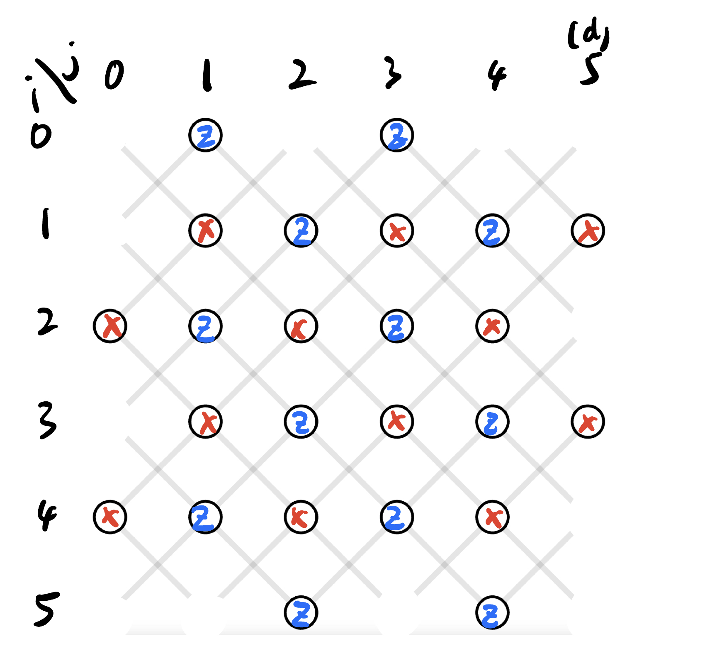
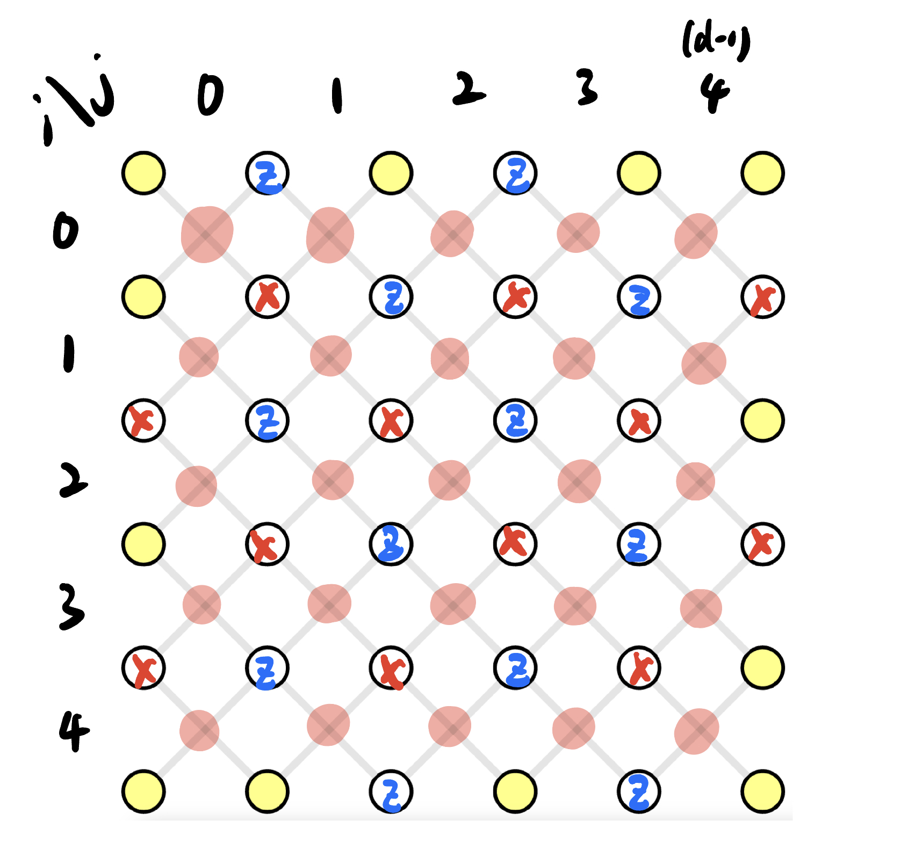

# Usage

```sh
pip3 install 
npm install
node demo.js
```

## Qubit Layout

We use two coordinations for stabilizers and data qubits.





## Yue's Development Note

I need to compile a special python binary for this project

```sh
maturin develop  # for development, quickly apply new version of the library
```
